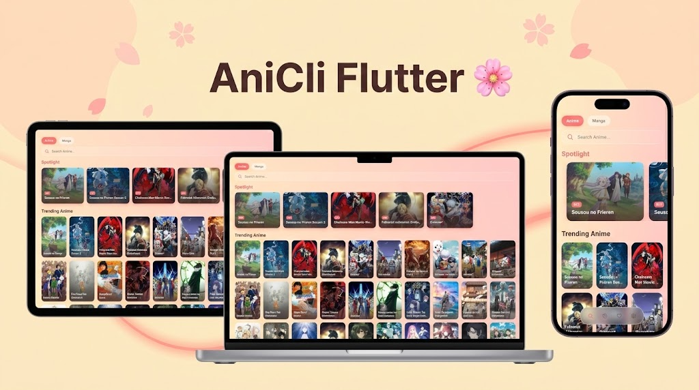

<p align="center">
  
</p>

# 🌸 Ani-Cli Flutter [EOL]


> **The Cozy Anime & Manga Client.**
> A beautiful, animated Flutter port of the [ani-cli](https://github.com/pystardust/ani-cli) shell script.

---

## 🛑 Project Status: End of Life (EOL)

**This project is no longer maintained.** 

This project has traveled far beyond my original expectations. What began as a simple Flutter port of a shell script evolved into a well-designed, "otaku/wibu hub" supporting English and Vietnamese content, Manga, and AO content. 

However, due to breaking changes in backend provider logic and technical limitations (specifically SSL/BoringSSL issues on Android/Flutter), many features are now broken. 

### 📝 Final Words from the Developer:
> "This project is far from my expectations—from a simple app to watch anime to a nice-looking, well-designed 'otaku/wibu hub.' It has ENG/VI manga/anime and even AO content support, but now, everything is breaking. I would like to thank everyone who downloaded and used this app." — **minhmc2007**

**Feel free to fork and modify the code, but please respect the license. It exists for a reason.**

---

## ✨ Features (Legacy)

*   **🎨 Cozy UI**: A relaxing, pastel-themed interface with live moving gradients and milky glassmorphism.
*   **📖 Manga Reader**: Integrated **MangaDex** (Global) and **ZetTruyen** (Vietnamese) support.
*   **🎞️ Flexible Player**: Support for internal playback and system-level MPV.
*   **🔍 Multi-Source**: Scrapers for `AllAnime` (EN), `PhimAPI` (VI), and `ZetTruyen`.
*   **✨ Animations**: Smooth Hero transitions and hover effects using `flutter_animate`.

---

## ⚠️ Known Issues

*   **SSL/Networking:** The `AllAnime` (EN) source requires **OpenSSL** (tested on Linux/CachyOS). On Android/Mobile, `BoringSSL` limitations often cause network faults.
*   **Broken Streams:** Several backend scrapers have updated their security/logic, causing video stream failures in the current build.

---

## 🛠️ Installation (For Developers/Forking)

If you wish to attempt to fix the scrapers or study the UI logic:

```bash
# Clone
git clone https://github.com/minhmc2007/AniCli-Flutter
cd AniCli-Flutter

# Install Dependencies
flutter pub get

# Run
flutter run
```

---

## 🏗️ Architecture

*   **`lib/api/ani_core.dart`**: Port of Bash script logic and AllAnime GraphQL queries.
*   **`lib/api/manga_core.dart`**: Communication with MangaDex and ZetTruyen APIs.
*   **`lib/user_provider.dart`**: State Management for History and Favorites.
*   **`lib/main.dart`**: The "Cozy" UI layer, LiveGradientBackground, and GlassDock.

---

## 🙏 Credits

This project was built upon the hard work of many providers and developers:

*   **Original Logic**: [ani-cli](https://github.com/pystardust/ani-cli) by pystardust.
*   **Anime Scrapers**: [Sudachi](https://github.com/KabosuNeko/Sudachi) / PhimAPI.
*   **Manga Sources**: [MangaDex](https://mangadex.org) and [ZetTruyen](https://www.zettruyen.africa).
*   **NSFW/AO Content**: [HentaiVietsub](https://hentaivietsub.com).
*   **UI/Framework**: [Flutter](https://flutter.dev).

---

## 📜 License

This project is licensed under the **GPLv3 License**, inheriting the license from the original `ani-cli` project. If you fork this project, you **must** keep the source code open under the same license.
